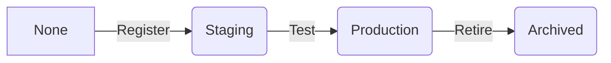

# **Conceptual Guide: Model Registry & Deployment Fundamentals**

## **1. Model Registry Core Concepts**

### **1.1 Definition & Purpose**
A model registry is a centralized hub for:
- **Version control** - Track model iterations
- **Collaboration** - Share models across teams
- **Governance** - Manage approval workflows
- **Deployment** - Serve models to production

### **1.2 Key Components**
| Component | Description | Example |
|-----------|-------------|---------|
| Registered Model | Logical grouping of versions | "Fraud-Detection" |
| Model Version | Iteration with unique ID | v1, v2, v3 |
| Stage | Lifecycle phase | Staging/Production |
| Annotations | Documentation | Training dataset info |
| Metadata | Additional context | Framework, metrics |

## **2. Model Lifecycle Stages**

### **2.1 Standard Workflow**


### **2.2 Stage Definitions**
- **Staging**: QA/validation environment
- **Production**: Live business use
- **Archived**: Retired but kept for compliance

## **3. Deployment Patterns**

### **3.1 Common Deployment Options**
| Type | Latency | Throughput | Use Case |
|------|---------|------------|----------|
| Batch | High | High | Overnight predictions |
| REST API | Low | Medium | Real-time apps |
| Streaming | Very Low | Low | Fraud detection |
| Edge | Variable | Variable | IoT devices |

### **3.2 Deployment Architecture**
```
[Model Registry] --> [Deployment Target]
                       ├── Kubernetes Cluster
                       ├── Serverless Function
                       ├── Databricks Model Serving
                       └── Edge Device
```

## **4. Model Registry Operations**

### **4.1 Version Management**
- **Autoversioning**: Incremental version numbers
- **Aliases**: Human-readable pointers (e.g., "champion")
- **Semantic Versioning**: Major.Minor.Patch scheme

### **4.2 Transition Controls**
```python
# Sample approval workflow
if validation_accuracy > threshold:
    client.transition_model_version_stage(
        name="Fraud-Detection",
        version=3,
        stage="Production",
        archive_existing_versions=True
    )
```

## **5. Deployment Considerations**

### **5.1 Serving Requirements**
| Factor | Considerations |
|--------|----------------|
| Latency | <100ms for real-time |
| Scalability | Auto-scaling configuration |
| Monitoring | Drift detection hooks |
| Security | TLS, authentication |

### **5.2 Canary Deployment Example**
1. Route 5% traffic to new model
2. Monitor performance metrics
3. Gradually increase to 100%

## **6. Governance Features**

### **6.1 Access Control Matrix**
| Role | Permissions |
|------|-------------|
| Data Scientist | Register models |
| ML Engineer | Deploy to staging |
| Ops Team | Production deployments |
| Auditor | Read-only access |

### **6.2 Audit Trail**
- Who deployed which version
- When transitions occurred
- Approval comments
- Performance snapshots

## **7. Integration Ecosystem**

### **7.1 CI/CD Pipeline**
```
[Git Commit] → [Model Training] → [Registry] → [Deployment] → [Monitoring]
```

### **7.2 Monitoring Tools**
- Performance metrics (accuracy, latency)
- Data drift detection
- Resource utilization
- Business impact tracking

## **8. Key Benefits**

1. **Reproducibility**: Exact model versions for audit
2. **Rollback**: Quick revert to stable versions
3. **Collaboration**: Shared visibility across teams
4. **Compliance**: Documentation for regulators
