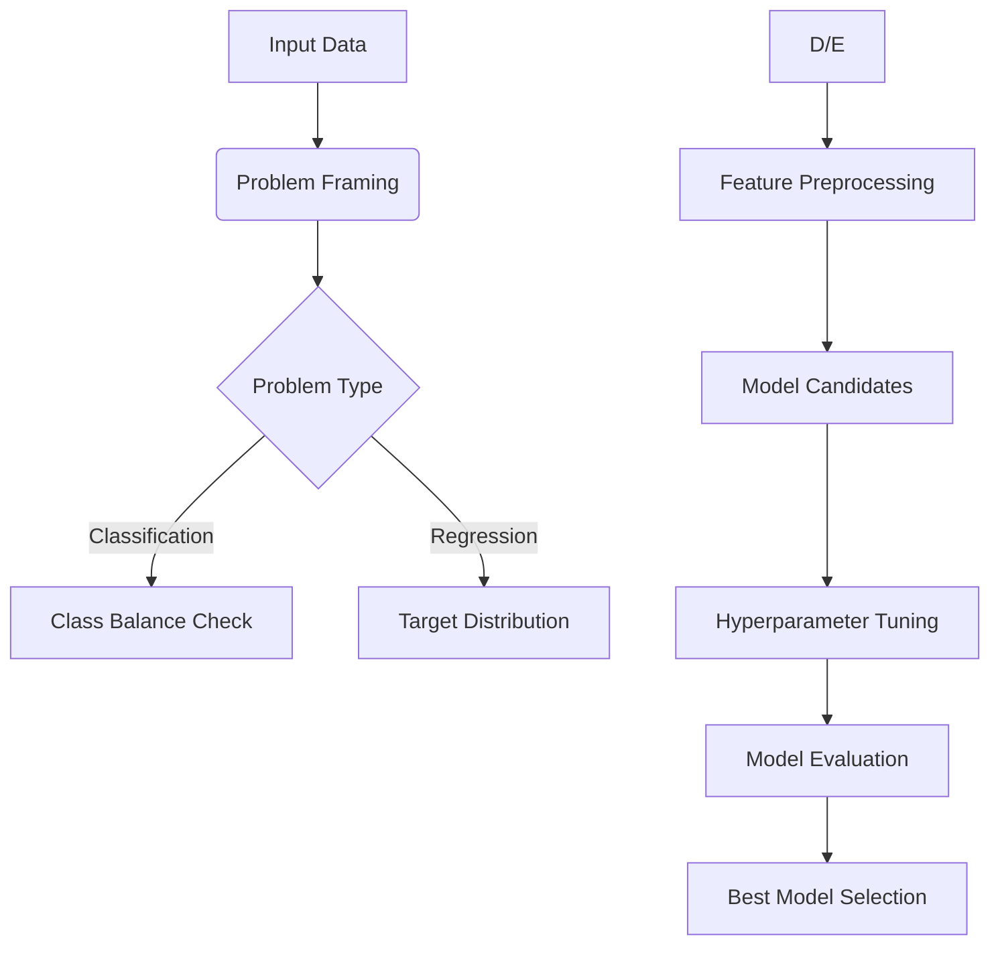

# **Feature Store & AutoML Fundamentals**

## **1. Feature Store: Centralized Feature Management**

### **1.1 Core Concepts**
**Definition:** A centralized repository for:
- Storing curated features
- Sharing/reusing features across teams
- Ensuring consistency between training & serving

**Key Components:**
| Component | Purpose | Example |
|-----------|---------|---------|
| Feature Tables | Logical groupings | `user_behavior_features` |
| Primary Keys | Unique identifiers | `user_id`, `timestamp` |
| Feature Definitions | Code to compute features | `30d_avg_spend` |
| Metadata | Documentation & lineage | Data source, owner |

### **1.2 Architecture Overview**
```
[Data Sources] → [Feature Engineering] → [Feature Store]
                                     ↓              ↓
                              [Model Training]  [Real-time Serving]
```

### **1.3 Key Capabilities
- **Point-in-Time Correctness**: Avoids data leakage with time travel
- **Batch & Streaming Support**: Unified feature computation
- **Feature Sharing**: Discoverability through catalog
- **Consistency**: Same features in training and inference

## **2. Feature Store Operations**

### **2.1 Workflow Stages
1. **Feature Creation**:
   ```python
   # Compute features
   from databricks.feature_store import FeatureStoreClient
   fs = FeatureStoreClient()
   
   fs.create_table(
       name="user_features",
       primary_keys=["user_id"],
       df=feature_df,
       description="User behavior features"
   )
   ```

2. **Feature Consumption**:
   ```python
   # Training
   training_set = fs.create_training_set(
       df=labels_df,
       feature_lookups=[
           FeatureLookup("user_features", ["user_id"])
       ]
   )
   ```

3. **Online Serving**:
   ```python
   # Real-time prediction
   features = fs.get_feature_vector(
       feature_table="user_features",
       key_values={"user_id": 12345}
   )
   ```

## **3. AutoML: Automated Machine Learning**

### **3.1 Core Principles
**Definition:** Automated processes for:
- Model selection
- Hyperparameter tuning
- Feature engineering
- Model validation

**Key Benefits:**
- Democratizes ML for non-experts
- Accelerates prototyping
- Provides baseline models

### **3.2 AutoML Workflow


## **4. AutoML Capabilities**

### **4.1 Supported Tasks
| Task Type | Algorithms | Evaluation Metrics |
|-----------|------------|--------------------|
| Classification | XGBoost, LightGBM, CatBoost | Accuracy, F1, AUC |
| Regression | Random Forest, GBTs | RMSE, R² |
| Forecasting | Prophet, ARIMA | SMAPE, MAE |

### **4.2 Customization Options
- **Feature Engineering**:
  - Automated feature interaction detection
  - Missing value imputation strategies
  - Categorical encoding methods

- **Training Control**:
  ```python
  automl_run = databricks.automl.classify(
      dataset=df,
      target_col="churn",
      timeout_minutes=30,
      exclude_columns=["user_id"]
  )
  ```

## **5. Integration with ML Lifecycle**

### **5.1 Feature Store + AutoML Synergy
1. **Feature Discovery**:
   - AutoML suggests relevant features
   - Feature importance analysis

2. **Reproducible Pipelines**:
   ```python
   # Auto-generated notebook includes:
   feature_store_code = """
   fs.get_feature_vector(table='user_features', ...)
   """
   ```

### **5.2 Deployment Patterns
- **AutoML → Model Registry**:
  ```python
  best_model = automl_run.best_model
  mlflow.register_model(best_model, "automl_churn")
  ```

- **Feature Store → Serving**:
  ```python
  fs.deploy_model(
      model_uri="models:/automl_churn/1",
      feature_tables=["user_features"]
  )
  ```

## **6. Organizational Impact**

### **6.1 Team Efficiency Gains
- **Data Scientists**: Focus on complex problems
- **Analysts**: Build baseline models independently
- **ML Engineers**: Standardized feature pipelines

### **6.2 Governance Benefits
- **Feature Documentation**: Central metadata
- **Model Transparency**: AutoML experiment tracking
- **Audit Trails**: Feature lineage tracking
